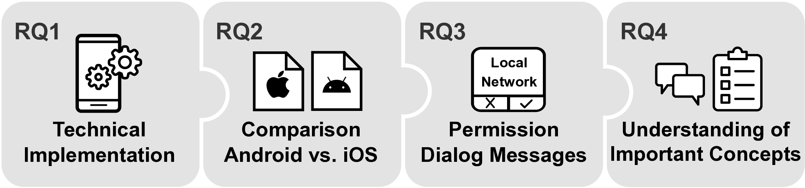

# Analyzing the iOS Local Network Permission from a Technical and User Perspective - Artifacts



We analyzed the local network permission from a technical and user perspective.
* To study the permission implementation, we designed a test app.
* To find out how prevalent local network access is, we dynamically analyzed apps on Android and iOS.
* We extracted and studied the concepts present in the messages shown alongside the permission.
* We performed a user study to analyze users' understanding of the local network and common misconceptions.

For more details, see our [paper](./misc/paper.pdf).

## Folder Structure
* [RQ1: Test app](./test_app/)
* [RQ2: Android app interaction](./dynamic_interaction/android_dynamic/)
* [RQ2: iOS app interaction](./dynamic_interaction/ios_dynamic)
* [RQ2: Traffic evaluation](./evaluation/scan_detector/)
* [RQ3: Rationale classification](./evaluation/clasification/)
* [RQ4: User study evaluation scripts](./evaluation/user_study/)


## How to cite:

```
@inproceedings{2025:local_network,
    title     = {{Analyzing the iOS Local Network Permission from a Technical and User Perspective}},
    author    = {Schmidt, David and Ponticello, Alexander and Steinböck, Magdalena and Krombholz, Katharina and Lindorfer, Martina},
    booktitle = {Proceedings of the 46th IEEE Symposium on Security and Privacy (S\&P)},
    doi       = {10.1109/SP61157.2025.00045},
    year      = {2025},
}


```

## Contacts

* David Schmidt:
    * email: dschmidt@seclab.wien
    * twitter: [@dschm1dt](https://twitter.com/dschm1dt)
    * Topics:
        * Test app
        * Dynamic analysis
        * Rationale extraction
* Alexander Ponticello:
    * email: alexander.ponticello@cispa.de
    * twitter: [@alip0nti](https://twitter.com/alip0nti)
    * Topics:
        * Rationale classification
        * User study
* Magdalena Steinböck
    * email: magdalena.steinboeck@seclab.wien
    * GitHub: [@magdasteinb](https://github.com/magdasteinb)
    * Topics:
        * Dataset
        * Dynamic analysis - iOS
* Katharina Krombholz
    * email: krombholz@cispa.de
* Martina Lindorfer
    * email: martina@seclab.wien

